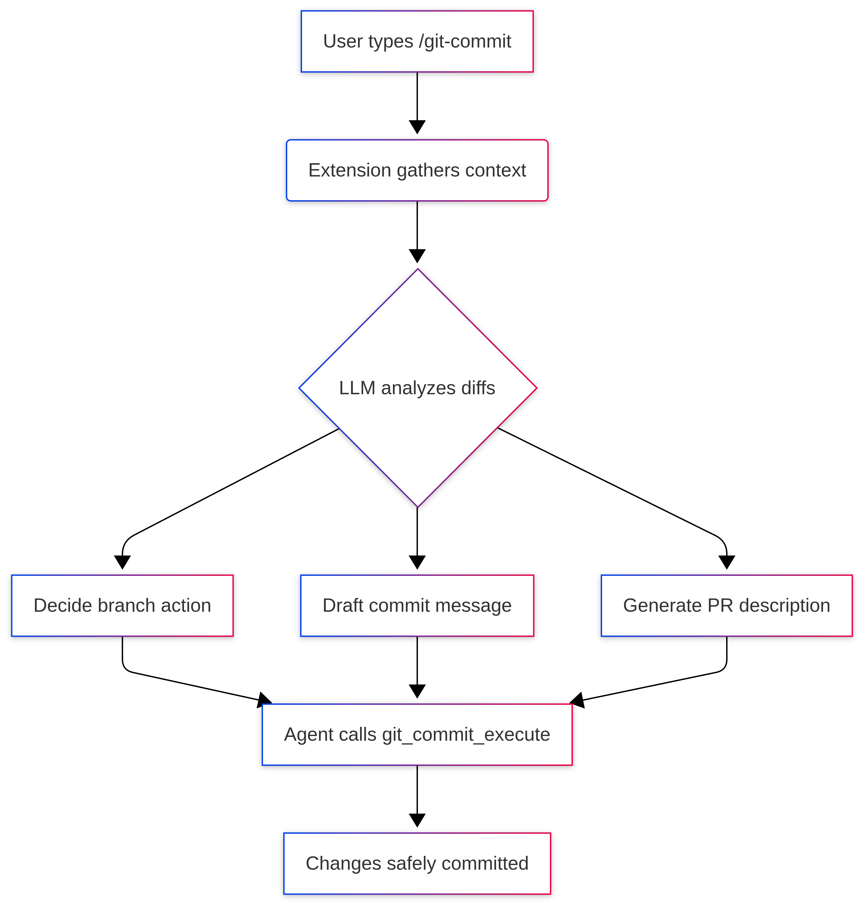

# 🤖 pi-git-assistant

[](https://www.npmjs.com/package/pi-git-assistant)
[](https://opensource.org/licenses/MIT)

**An agent-driven git commit assistant for [pi](https://pi.dev).**

Stop wrangling git branches and writing commit messages by hand. The LLM reads your diffs, understands your actual code changes, decides the correct branch, writes a conventional commit message, and crafts a professional PR description—all automatically. 

*No hidden logic. No hardcoded heuristics. 100% safe, read-only git analysis until you execute.*

https://github.com/user-attachments/assets/ab41b902-a6af-4ea6-8dcc-3c264a16165f

## 🚀 Installation

Install globally via npm (recommended):
```bash
pi install npm:pi-git-assistant
```

Or install directly from the repository:
```bash
pi install git:github.com/elt7613/pi-git-assistant
```

## ⌨️ Commands

| Command | Action |
|---------|--------|
| `/git-commit` | Commits **only** the files modified during your current active pi session. |
| `/git-commit-all` | Commits **all** uncommitted changes in the repository. |

### Optional Arguments
Append these to any command to customize the LLM's behavior:
- `give pr description` — Generates a comprehensive PR description alongside the commit.
- `use branch <name>` — Forces the LLM to commit to the specified branch instead of analyzing and creating its own. *(e.g., `/git-commit use branch feat/auth`)*

## 🧠 How It Works

We don't use simple scripts. The LLM natively understands your intent and acts accordingly:

1. **Context Gathering:** The extension fetches `git status`, diffs, and tracks session files.
2. **Analysis:** The LLM reads the actual code modifications to understand the feature or fix.
3. **Decision & Formatting:** 
   - **Branch:** Determines whether to stay, switch, or create a new semantic branch (e.g., `feat/...`, `fix/...`).
   - **Message:** Generates a strict conventional commit message (< 72 characters, imperative mood).
4. **Execution:** The agent safely triggers the internal `git_commit_execute` tool to apply the changes.




## 🛡️ Strict Safety & Branch Rules

We enforce strict guardrails inside the LLM prompt to protect your repository:

- **Protected Branches:** It will **always** create a new branch if you are currently on `main`, `master`, or `develop`.
- **Zero Hallucination Tolerance:** Current branches get no special treatment. If the code changes do not perfectly match the current branch intent, the LLM will create a new one. 
- **Safe Commands Only:** The extension operates purely through read-only git analysis until the final execution. It uses `git checkout`, `git add`, and `git commit`. 
  - *It **never** uses stash, restore, reset, rebase, merge, cherry-pick, clean, pull, or push.*

## 🕒 Persistent Session Tracking

Working across multiple days? No problem. 

Any files touched by the `write` or `edit` tools during your pi session are automatically tracked. This tracking survives a session `/resume`—meaning `/git-commit` will still perfectly remember the scope of your work even if you restart your environment.
